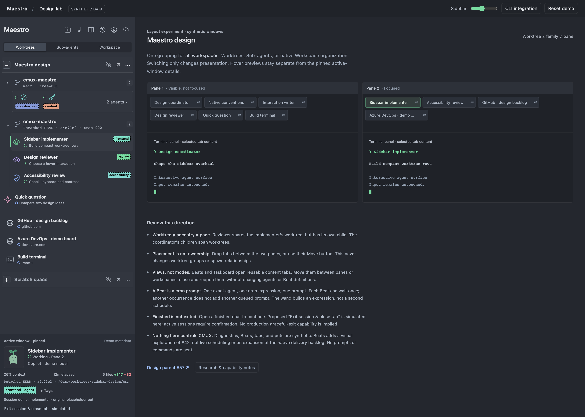

# Visual design lock - 2026-09-25

**Owner:** Dylan McCurry. **Purpose:** a reproducible visual and interaction
reference for the CMUX Maestro backlog, not production implementation.

The human approved the refined prototype and requested this dated lock on
2026-09-25. It supersedes the appearance and interactions of the September 22
target linked from [#57](https://github.com/jdylanmc/cmux-maestro/issues/57).
Earlier comments, delivered features, and native evidence remain history;
this update does not revoke completed work.



## What is locked

| Surface | Confirmed direction |
| --- | --- |
| Header | Folder-plus, Beats quarter note, Taskboard columns, History clock/arrow, Settings gear, Fermata arc/dot, in that order. Icon-only, labelled for assistive technology and tooltips. |
| Grouping | One global Worktrees / Sub-agents / Workspace selector. No Hierarchy toggle, Group all workspaces caption, or top-level Workspaces heading. |
| Workspace row | Boxed disclosure, name, finished eye, backlog arrow, overflow. Only the name text triggers the workspace preview. |
| Finished visibility | Independent eye per workspace in agent projections. Native Workspace projection keeps all open tabs and disables the filter. Hiding a row is not ending a chat. |
| Agent rows | Reduced margins and nesting, animated working indicator with reduced-motion fallback, distinct needs-input indicator, no inline state words or redundant information button. Equivalent keyboard preview is required; the mock has the exceptions below. |
| Tags | Same compact size, inline with the agent title and right-aligned. Title readability wins when space is tight; full labels stay available in details. |
| Tag identity/color | Stable normalized slug determines the automatic color scheme. Text contrast is at least 4.5:1. Human-only swatch overrides apply to that slug everywhere; agents assign tags, not colors. Both assignment sources remain attributable. |
| Sidebar reordering | Siblings only: workspace, worktree, agent-tree, pane and individual row units. Groups carry their contents. No cross-container drop, identity change or reparenting. |
| Utility views | Beats and Taskboard open reusable native-style content tabs, not sidebar modes. Explicit view movement can target another pane/workspace; closing/moving a view does not change agents or schedules. |
| Beats | Exact target agent + cron expression + prompt. Multiple Beats per agent; at most one pending occurrence per Beat. Wand popup builds the same expression from friendly controls. Diagnostics distinguish delivery from completion. |
| Directory shortcut | Folder-plus opens a directory as a new workspace. The prototype substitutes example-path entry for the future native selection/creation flow. |
| Settings | Quick access to Maestro-specific settings. Final native destination is not prescribed. |
| Fermata | Toggle CMUX's existing Keep Mac Awake state. No independent wake service, duration or automatic activation. |
| Default demo | Remove artificial stale/unknown/contrast-probe clutter. This does not authorize hiding real errors, missing evidence or protected activity. |

## Meaningful boundaries

- `prototype/` is a synthetic browser mock. No native host integration,
  installed-app changes, real timers, provider prompt delivery, filesystem
  directory opening, process controls or power-management changes occur.
- The surrounding Design lab controls and right-hand explanatory native-layout
  stage are review tools, not automatically additional production sidebar UI.
- Existing exact ownership, sandbox, typed-host, bounded-observation and
  non-escalating permission constraints remain. The mock is not an alternate
  transport or an authorization to copy control code into the sidebar.
- The explicit **sidebar sibling-reorder gesture** is distinct from the
  prototype's right-hand cross-pane surface movement and explicit utility-tab
  Move dialog. Do not infer unrestricted sidebar cross-container drops.
- The inherited older-host/theme, worktree evidence, provider-child fallback,
  real lifecycle and unavailable-state requirements remain in their issues.
  Removing diagnostic fixtures is not deleting those requirements.
- Completed #4, #49, #52 and #76 remain completed. Taskboard and workspace-hover
  changes need targeted follow-ups, not reopened or duplicated delivered work.
- The native implementation remains separately owned. This documentation PR
  grants no dispatch, claim, live-session, installation or merge authority.

## Deliberately not settled by the mock

| Topic | What still needs a production decision/evidence |
| --- | --- |
| Beats scheduling | Cron dialect, timezone/DST, offline catch-up, persistence, permissions, exact target lifetime, supported queue/delivery API and fairness. UTC and the simulation clock are not the product timezone policy. |
| Queued prompt edits | The mock retains pending work on pause and requires cancelling before edits. These are visible proposals, not new confirmed production guarantees. |
| Manual runs | Run now while paused and simulated delivery counters are examples; settle actual admission, failure and delivery evidence. |
| Utility hosting | Supported native/browser-backed surface route, reuse scope across windows, persistence/restoration and unsaved-draft closure. The mock's browser-origin singleton is not a system-wide contract. |
| Diagnostics | Model/provenance/ports/background-process/context-capacity coverage needs authoritative sources. Some richer fields are absent from this mock, not removed from #73-81. Copy session ID (#76) remains delivered even where the mock omits it. |
| Tags | Shared system-wide storage, exact agent authorization, canonicalization version/limits and compatibility. The reference UI normalizes Unicode NFKC/lowercase/delimiters; localStorage is not production cross-session persistence. |
| Pets | Asset-specific redistribution rights and native status/animation behavior. The three geometric pets are original placeholders, not licensed Codex artwork. |
| Directory/settings | Native chooser/create-workspace capability, duplicate-directory policy, partial failure handling, and settings destination. |
| Native theme/Fermata | Real host palette and Keep Mac Awake read/write notifications, denied/unknown/pending states and exact host lifetime. A local demo preference is not the source of truth. |

These gaps are not reasons to invent screenshots or declare integrations
implemented. The [issue audit](issue-audit.md) distinguishes target changes,
unchanged obligations, completed work and new follow-ups.

## Known prototype exceptions from independent review

The [independent review](review.md) found two important interaction defects.
They are **not approved production behavior** and do not alter the visual
direction being frozen:

1. Workspace-name and collapsed-summary previews lack equivalent keyboard
   activation. Expanded-row focus previews exist, but normal Tab traversal
   cannot reach their interactive actions before dismissal. Acceptance in
   #43/#46/#58 and the workspace-hover follow-up requires closing these gaps.
2. After pane reordering, the utility Move dialog still labels Pane 1 "left"
   and Pane 2 "right." Its future host implementation must derive positions
   from the destination workspace or omit spatial descriptions.

The byte-exact prototype is retained as reviewed, rather than silently fixed
after the human's visual approval. Screenshots of normal initial order do not
demonstrate these exceptional transitions.

## Reproduce the visual target

From this directory:

```sh
python3 prototype/serve.py
```

Open `http://127.0.0.1:8765/`. The allowlisted server binds loopback only.
It serves the UI assets, not the surrounding repository.

The default scenario is clean. The eye, grouping selector, header actions,
menus, tag editor and utility tabs drive the interactive scenarios.
The Beats simulation controls are explicitly manual; waiting does not deliver
prompts. Choose Reset demo to clear this origin's local synthetic preferences.

For tests/capture, install the prototype's recorded dependencies only inside
`prototype/`, with Chrome available:

```sh
cd prototype
npm ci
PROTOTYPE_URL=http://127.0.0.1:8765/ npm test
cd ..
PROTOTYPE_URL=http://127.0.0.1:8765/ node capture.cjs
```

To use another loopback port without changing the frozen server:

```sh
python3 -c 'import runpy; m=runpy.run_path("prototype/serve.py"); m["ThreadingHTTPServer"](("127.0.0.1", 8766), m["Handler"]).serve_forever()'
```

Set `PROTOTYPE_URL` accordingly. Captures use isolated browser preferences,
1512x1080 viewport, 2x scale and reduced motion. `capture.cjs` uses the existing
Chrome channel; it does not install or open a shared interactive browser.

## Evidence and provenance

- [Capture manifest](evidence/capture.json): descriptions, image hashes,
  browser version and explicit test-only scenarios.
- [Core interaction checks](evidence/verification.json).
- [Beats/header checks](evidence/verification-beats.json).
- [Sidebar reorder/deep-layout checks](evidence/verification-sidebar.json).
- [Shared tag-color/contrast checks](evidence/verification-tags.json).
- [Frozen source/image digest manifest](evidence/manifest.json).
- [Independent review](review.md), including coverage limits and follow-ups.

The suite at this snapshot records 135 core, 57 Beats/header, 32 sidebar and
35 tag checks. The measured eight-level name-row widths are 168px at a 280px
sidebar and 238px at 350px; title-inline tags do not truncate the test name.
The sampled automatic tag schemes exceeded 4.5:1, and all supplied human
swatches were checked using rendered foreground/background colors.

Static images cannot prove animation, drag/drop completion, permissions,
native focus, ownership, queue delivery or real liveness. The browser tests
establish only the mock's behavior. Independent review does not authorize
shipping, merging or claiming unsupported native acceptance.

## Focused references

| Topic | Images |
| --- | --- |
| Sidebar modes | [Worktrees](images/worktrees.png), [Sub-agents](images/subagents.png), [Workspace](images/workspace.png) |
| Chrome | [Header](images/header.png), [workspace eye](images/workspace-history-eye.png), [Fermata](images/fermata.png) |
| Details | [Agent hover + pinned details](images/agent-hover.png), [workspace name hover](images/workspace-hover.png) |
| Appearance | [Inline tags](images/tags-inline.png), [tag colors](images/tag-colors.png), [tag editor](images/tag-editor.png), [pets](images/pet-picker.png), [browser icon](images/browser-icon.png) |
| Organization | [Sibling insertion cue](images/sidebar-reorder.png), [deep-nesting fixture](images/deep-nesting.png), [directory opening](images/open-directory.png) |
| Utility views | [Beats](images/beats.png), [cron builder](images/cron-builder.png), [queue diagnostics](images/beat-diagnostics.png), [Taskboard](images/taskboard.png), [Move view](images/utility-move.png) |
| Actions | [Agent menu](images/agent-menu.png), [workspace menu](images/workspace-menu.png), [History](images/history.png), [exit confirmation](images/exit-confirm.png), [descendant scope](images/exit-scope.png), [Settings](images/settings.png) |
