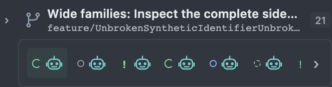

# Approved sidebar refinement - 2026-09-29

**Approved by Dylan McCurry on September 29, 2026 at 21:03 EDT.**
This locks the reviewed HTML POC's internal-task presentation, overflow fixes,
per-parent task disclosure, and horizontally scrolling icon cards. It preserves
the earlier September 25 baseline and September 26 copy/lift approvals without
overwriting their evidence.

This is a **visual and interaction target**, not native delivery, a specification
merge, or approval of every inherited demo behavior. The visual-overhaul epic
[#57](https://github.com/jdylanmc/cmux-maestro/issues/57) update remains a separate
step. No tracker mutations, commits, pushes, installation or live-session
changes are part of this lock.

The subsequent [review and backlog reconciliation](../sidebar-review/README.md)
records additional findings and separately authorized non-destructive ticket
updates. It does not change this frozen source or approve its known defects.

## Approved contract

| Surface | Locked direction |
| --- | --- |
| Interactive tabs | Agent chats, terminals and browsers retain identity icons and real selection behavior. A Maestro-spawned terminal agent is an interactive destination. |
| Internal Copilot tasks | Non-interactive activity belongs beneath its exact spawning parent. One line per task, branch connectors, no identity/avatar/ghost icon and no fabricated chat target. |
| Task state | Green spinner only for actual working state; muted completion check, red failure cross, and distinct blocked/input/idle/unknown/cancelled marks. No visible Working/Finished/Failed labels. Tooltips and accessible names preserve meaning; Reduce Motion stops animation without changing the state. |
| Nested task geometry | Only the left edge indents. Right edges and state columns remain aligned, not funnel-shaped. Narrow task containers use a smaller consistent indentation. |
| Task visibility | Idle tasks hide by state, not time. Finished outcomes remain until their exact outcome is dismissed. Attention and necessary ancestry are protected. New work/outcomes can return; dismissal never closes a tab or session. |
| Workspace eye | Reveals idle internal tasks, not unknown, cancelled or dismissed outcomes. Existing finished-chat visibility remains a separate inherited behavior outside this task category. Native Workspace never filters real tabs. |
| Per-parent disclosure | Internal tasks collapse independently in all three projections. Collapse state survives view changes and reload. Working/attention counts remain discoverable; separate child-agent tabs are unaffected. |
| Main sidebar containment | Long branches ellipsize without covering counts or widening the sidebar. Full values remain accessible. Long browser metadata wraps in pinned details. No main-sidebar horizontal scrolling. |
| Hover containment | Full names, paths, URLs, histories and metrics wrap inside the card. Vertical scrolling is allowed; horizontal scrolling is not. Copy values are unchanged, not shortened to fit. |
| Collapsed worktree card | One non-wrapping horizontal row containing **all** visible participant icons, with state cues. No tags, names, grid, four-item cutoff, or `+N` tag disclosure in this view. |
| Local card scrolling | Horizontal scrolling belongs only to the card's inner viewport. Wheel, keyboard, full previews, selection, sibling ordering, and a separate expand control remain available. Rerendering/selection preserves card position. |
| Tags elsewhere | Expanded rows, hover previews and pinned details retain tags and their existing ownership/color behavior. |

The final icon-card direction **supersedes RF-04's one-tag-plus-disclosure
experiment**. RF-01, RF-02, RF-03, RF-05 and RF-06 are the active reviewed
refinements. The working [review log](../../2026-09-25/README.md) preserves the
sequence for the later epic reconciliation.

## Frozen evidence

- [Capture manifest](capture.json): exact SHA-256 source/image digests, browser
  conditions, state/scroll/geometry observations and approval scope.
- [Archive receipt](archive.json): hash and size of
  `sidebar-refinement-target-20260929.zip`.
- The ZIP contains the exact runnable `prototype/`, its recorded dependencies
  and verification scripts, the synthetic captures and `evidence/capture.json`.
  It excludes `node_modules`, generated test debris, private screenshots,
  credentials and native build products.

The source was captured from an **uncommitted worktree**. The manifest's base
commit is provenance only, not the approved source revision. The ZIP and
per-file SHA-256 values identify the frozen bytes.

| Capture | Purpose |
| --- | --- |
| [Overview](images/overview.png) | Readable default sidebar and synthetic design lab. |
| [Internal tasks](images/internal-tasks.png) | Compact task lines and status marks beneath an interactive tab. |
| [Icon card, start](images/icon-card-start.png) | Single-row, icon-only collapsed worktree card. |
| [Icon card, end](images/icon-card-end.png) | Later participants reached by local horizontal scrolling, not a four-item sample. |
| [Collapsed tasks](images/collapsed-tasks.png) | Working/attention summary without removing the actual parent tab. |
| [Nested tasks](images/nested-tasks.png) | Fixed right edge through the deep stress tree. |
| [Wrapped hover](images/wrapped-hover.png) | Long metadata wraps; only vertical scrolling remains. |
| [Narrow sidebar](images/narrow-sidebar.png) | The readable fixture at 280px. |



All images are actual isolated-browser captures of synthetic data. Static
images alone do not prove animation or scrolling; the manifest records the
working/reduced-motion styles and the icon card's distinct scroll positions.
The frozen verification scripts cover the behavior, including narrow widths,
keyboard interactions, persistence and identity preservation.

## Reproduce

Extract the ZIP into a new directory, then serve its allowlisted assets:

```sh
unzip sidebar-refinement-target-20260929.zip -d sidebar-refinement-20260929
cd sidebar-refinement-20260929
python3 prototype/serve.py
```

The server binds `127.0.0.1:8765`; use a free port rather than replacing an
existing server. The extracted `prototype/package.json` provides the full
suite plus `test:stress` and `test:rapid-fire`. It uses the recorded Playwright
dependency and an available Chrome installation; dependencies are not bundled.

## Boundaries and remaining findings

- The Stress testing workspace is an approved **diagnostic fixture**, not a
  claim that unlimited data is solved: 61 agent chats, 172 internal tasks,
  two browsers, two terminals, wide families, 12-level trees and long data.
- Repeated-prefix session-name ambiguity, oversized row-action menus, History
  horizontal overflow and excessive detail/history density remain known
  findings. Freezing the source does **not** approve those failures.
- Existing row lift, field copy, tags, grouping, theme/accessibility and
  identity protections remain in force except where the contract above
  explicitly refines a surface.
- The archive still contains historical synthetic Beats and session-exit
  controls. Their presence does not reapprove them or establish native
  capabilities. Current #42/#60 decisions remain authoritative for that work.
- Design-lab controls and the explanatory stage are review tooling, not new
  production sidebar requirements. No live provider integration, timers,
  process control, installation, publishing or deployment is implied.
